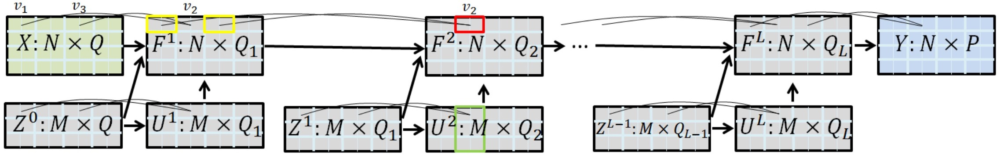

# Stochastic Deep Gaussian Processes over Graphs

This is the original implementation and results of the `DGPG` model proposed in our paper: [Stochastic Deep Gaussian Processes over Graphs, (NeurIPS 2020).](https://papers.nips.cc/paper/2020/hash/415e1af7ea95f89f4e375162b21ae38c-Abstract.html)



## Prerequests
our implementation is mainly based on `tensorflow 1.x` and `gpflow 1.x`:

```
python 3.x (3.7 tested)
pip install tensorflow-gpu==1.15
pip install keras==2.3.1
pip install gpflow==1.5
pip install gpuinfo
```
Besides, some basic packages like `numpy` are also needed.
It's maybe easy to wrap the codes for TF2.0 and GPflow2, but it's not tested yet.
## Specification

Source code and experiment result are both provided.

### Files

- `src/`
	- <span style="color: red">`dgp_graph`</span>: cores codes of the DGPG model.
		- <span style="color:red">`impl_parallel.py`</span>: a fast node-level computation parallelized implementation, invoked by all experiments.
		- <span style="color:blue">`my_op.py`</span>: some custom tensorflow operations used in the implementation.
		- <span style="color:grey">`impl.py`</span>: a basic loop-based implementation, easy to understand but not practical, leaving just for calibration.
	- <span style="color: blue">`data`</span>: datasets.
	- `doubly_stochastic_dgp`: codes from repository [DGP](https://github.com/ICL-SML/Doubly-Stochastic-DGP)
	- `compatible`: codes to make the DGP source codes compatible with gpflow1.5.
	- `gpflow_monitor`: monitoring tool for gpflow models, from [this repo](https://github.com/markvdw/gpflow-monitor).
	- `demo_city45.ipynb`: jupyter notebooks for city45 dataset experiment.
	- `experiments.zip`: jupyter notebooks for other experiments.
	- `run_toy.sh`: shell script to run additional experiment.
	- `toy_main.py`: code for additional experiment (Traditional ML methods and DGPG with linear kernel).
- `results.zip`: contains results of experiments
	- `*.html`: experiment results demonstrated by static HTML files.

### Experiments
The experiments are based on python src files and demonstrated by jupyter notebooks. The source of an experiment is under directory `src/experiments.zip` and the corresponding result is exported as a static HTML file stored in the directory `results.zip`. They are organized by dataset names:

1. Synthetic Datasets
	- `demo_toy_run1.ipynb`
	- `demo_toy_run2.ipynb`
	- `demo_toy_run3.ipynb`
	- `demo_toy_run4.ipynb`
	- `demo_toy_run5.ipynb`
2. Small Datasets
	- `demo_city45.ipynb`
	- `demo_city45_linear.ipynb` (linear kernel)
	- `demo_city45_baseline.ipynb` (traditional regression methods)
	- `demo_etex.ipynb`
	- `demo_etex_linear.ipynb`
	- `demo_etex_baseline.ipynb`
	- `demo_fmri.ipynb`
	- `demo_fmri_linear.ipynb`
	- `demo_fmri_baseline.ipynb`
3. Large Datasets (traffic flow prediction)
	- LA
		- `demo_la_15min.ipynb`
		- `demo_la_30min.ipynb`
		- `demo_la_60min.ipynb`
 	- BAY
		- `demo_bay_15min.ipynb`
		- `demo_bay_30min.ipynb`
		- `demo_bay_60min.ipynb`

Just run these notebooks to get the first-hand experience. Feel free to build your own experiments using core python codes.

## Citations
If you find this repository, e.g., the code and the datasets, useful in your research, please cite the following paper:

```
@article{li2020stochastic,
  title={Stochastic Deep Gaussian Processes over Graphs},
  author={Li, Naiqi and Li, Wenjie and Sun, Jifeng and Gao, Yinghua and Jiang, Yong and Xia, Shu-Tao},
  journal={Advances in Neural Information Processing Systems},
  volume={33},
  year={2020}
}
```